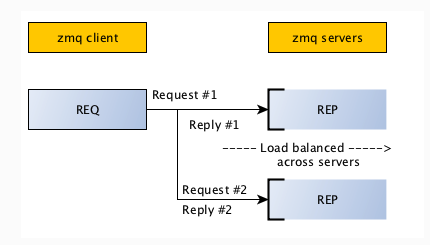
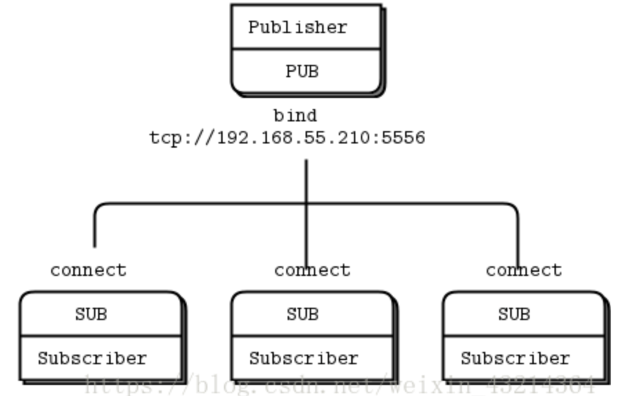
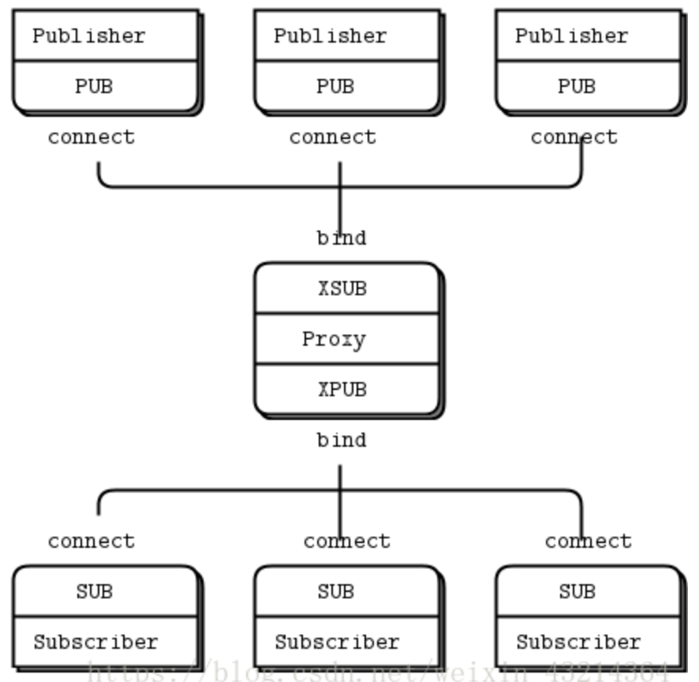

# ZeroMQ usage demo

test with post curl:

`curl -X POST -H "Content-Type: application/json" -d '{"name":"ZeroMQ"}' http://localhost:3000/`

## Deps

### System Deps

Need libzmq for Golang: https://github.com/zeromq/libzmq

- DEB: `http://software.opensuse.org/download.html?project=network%3Amessaging%3Azeromq%3Arelease-stable&package=libzmq3-dev`
- RPM: `https://software.opensuse.org/download.html?project=network%3Amessaging%3Azeromq%3Arelease-stable&package=zeromq-devel`

- Ubuntu: `apt install pkg-config libczmq4 libczmq-dev -y`
- MacOS: `brew install pkg-config zeromq`

### Test Env

- Node: v16.14.1 +
- Go: go1.19.4 +
- Python: 3.8.5 +

### Install Deps

- yarn
- go mod tody
- pip install flask zmq

### Golang cross build

MacOS: `brew install FiloSottile/musl-cross/musl-cross`

CGO_ENABLED=1 GOOS=linux GOARCH=amd64 CC=x86_64-linux-musl-gcc CGO_LDFLAGS="-static" go build -a -v -o BIN_NAME .

PS: Still not very good. Need to config LIBRARY_PATH, LD_LIBRARY_PATH, DYLD_LIBRARY_PATH and provide the cpp header files.

## Related Docs

- Curl with Header: https://reqbin.com/req/c-woh4qwov/curl-content-type

Python Flask:

- Flask: https://flask.palletsprojects.com/en/2.2.x/
- Recv Post Json: https://stackabuse.com/how-to-get-and-parse-http-post-body-in-flask-json-and-form-data/
- PyZMQ: https://pyzmq.readthedocs.io/en/latest/api/zmq.html

Official Links:

- The ZeroMQ project: https://github.com/zeromq
- Quick Get Start: https://zeromq.org/get-started/

How to Use:

- How to use ZeroMQ Pub/Sub Pattern in Node.js: https://dev.to/franciscomendes10866/how-to-use-zeromq-pub-sub-pattern-in-node-js-2i62
- How to use ZeroMQ Pub/Sub Pattern in Golang: https://dev.to/franciscomendes10866/how-to-use-zeromq-pub-sub-pattern-in-golang-4n3
- ZMQ and pyzmq Basics: https://learning-0mq-with-pyzmq.readthedocs.io/en/latest/pyzmq/basics.html

### C/S (client-server)

### Pub/Sub (publish-subscribe)

### xPub/xSub (xPublish-xSubscribe)

